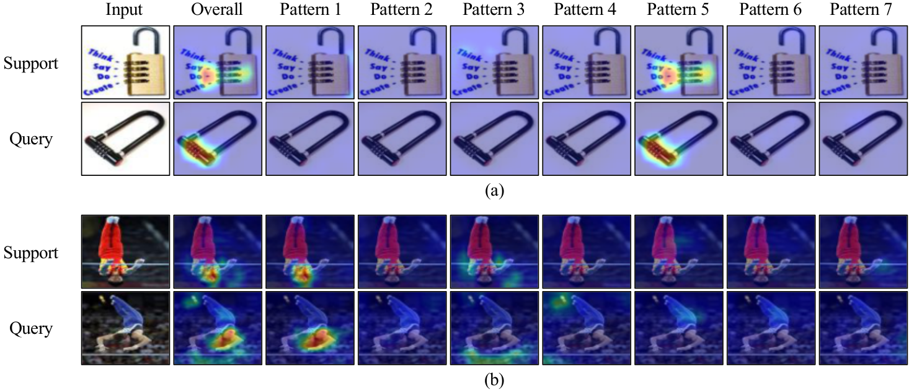

# Match Them Up: Visually Explainable Few-shot Image Classification
[PDF](https://openaccess.thecvf.com/content/CVPR2021W/RCV/papers/Wang_MTUNet_Few-Shot_Image_Classification_With_Visual_Explanations_CVPRW_2021_paper.pdf)

## Model Structure


## Abstract
Few-shot learning (FSL) approaches are usually based on an assumption that 
the pre-trained knowledge can be obtained from base (seen) categories and can 
be well transferred to novel (unseen) categories. However, there is no guarantee, especially 
for the latter part. This issue leads to the unknown nature of the inference process in most FSL 
methods, which hampers its application in some risk-sensitive areas. In this paper, we reveal a new 
way to perform FSL for image classification, using visual representations from the backbone model and weights 
generated by a newly-emerged explainable classifier. The weighted representations only include a minimum number 
of distinguishable features and the visualized weights can serve as an informative hint for the FSL process. 
Finally, a discriminator will compare the representations of each pair of the images in the support set and the 
query set. Pairs with the highest scores will decide the classification results. Experimental results prove that 
the proposed method can achieve both good accuracy and satisfactory explainability on three mainstream datasets.

## Usage

##### Env
```
sudo apt-get install python3.6
sudo apt-get install python3.6-venv python3.6-distutils
curl https://bootstrap.pypa.io/pip/3.6/get-pip.py -o get-pip.py
sudo python3.6 get-pip.py
python3.6 -m venv test
source test/bin/activate
python3.6 -m pip install --upgrade pip
pip install -r requirements
sudo apt-get install libgl1-mesa-glx
```

##### Data Set
Download miniImageNet from [miniImageNet](https://drive.google.com/open?id=0B3Irx3uQNoBMQ1FlNXJsZUdYWEE)

Download tieredImageNet from [tiered-ImageNet](https://drive.google.com/file/d/1g1aIDy2Ar_MViF2gDXFYDBTR-HYecV07/view)

Download cifarFS from [cifarfs](https://drive.google.com/file/d/1pTsCCMDj45kzFYgrnO67BWVbKs48Q3NI/view)

Put all dataset under "FSL_data", for the same split setting run the following command:

```
python data/tiered_imagenet.py --data "../FSL_data/tiered-imagenet/"
python data/cifarfs.py --data "FSL_data/cifar100/" --split "../FSL_data""

```


MTUNet training follow by three steps. All training default as 5-way 1-shot 15-query.
##### Training for backbone
```
python train_base.py --dataset miniImageNet --base_model resnet18 --channel 512 --num_classes 64 --data_root "../FSL_data"
python train_base.py --dataset miniImageNet --base_model wideres --channel 640 --num_classes 64 --data_root "../FSL_data"
python train_base.py --dataset tiered-ImageNet --base_model resnet18 --channel 512 --num_classes 351 --data_root "../FSL_data"
python train_base.py --dataset tiered-ImageNet --base_model wideres --channel 640 --num_classes 351 --data_root "../FSL_data"
python train_base.py --dataset cifarfs --base_model resnet18 --channel 512 --num_classes 64 --data_root "FSL_data"
python train_base.py --dataset cifarfs --base_model wideres --channel 640 --num_classes 64 --data_root "FSL_data"
```

##### Training for patterns
```
python train_scouter.py --random False --interval 10 --dataset miniImageNet --base_model resnet18 --channel 512 --num_classes 64 --data_root "../FSL_data"
python train_scouter.py --random False --interval 10 --dataset miniImageNet --base_model wideres --channel 640 --num_classes 64 --data_root "../FSL_data"
python train_scouter.py --random False --interval 10 --dataset tiered-ImageNet --base_model resnet18 --channel 512 --num_classes 351 --data_root "../FSL_data"
python train_scouter.py --random False --interval 10 --dataset tiered-ImageNet --base_model wideres --channel 640 --num_classes 351 --data_root "../FSL_data"
python train_scouter.py --random False --interval 10 --dataset cifarfs --base_model resnet18 --channel 512 --num_classes 64 --data_root "../FSL_data"
python train_scouter.py --random False --interval 10 --dataset cifarfs --base_model wideres --channel 640 --num_classes 64 --data_root "FSL_data"
```

##### Training MTUNet
```
python train_fsl.py --random False --interval 10 --dataset miniImageNet --base_model resnet18 --channel 512 --num_classes 64 --data_root "../FSL_data"
python train_fsl.py --random False --interval 10 --dataset miniImageNet --base_model wideres --channel 640 --num_classes 64 --data_root "../FSL_data"
python train_fsl.py --random False --interval 10 --dataset tiered-ImageNet --base_model resnet18 --channel 512 --num_classes 351 --data_root "../FSL_data"
python train_fsl.py --random False --interval 10 --dataset tiered-ImageNet --base_model wideres --channel 640 --num_classes 351 --data_root "../FSL_data"
python train_fsl.py --random False --interval 10 --dataset cifarfs --base_model resnet18 --channel 512 --num_classes 64 --data_root "../FSL_data"
python train_fsl.py --random False --interval 10 --dataset cifarfs --base_model wideres --channel 640 --num_classes 64 --data_root "FSL_data"
```

##### Test MTUNet
```
python test_fsl.py --random False --interval 10 --dataset miniImageNet --base_model resnet18 --channel 512 --num_classes 64 --data_root "FSL_data"
```

##### Visualization of MTUNet
```
python vis_fsl.py --random False --interval 10 --dataset miniImageNet --base_model resnet18 --channel 512 --num_classes 64 --data_root "FSL_data"
```

#### Patterns visualization


#### Matching matrix


## Publication
If you want to use this work, please consider citing the following paper.
```
@inproceedings{wang2021mtunet,
 author = {Wang, Bowen and Li, Liangzhi and Verma, Manisha and Nakashima, Yuta and Kawasaki, Ryo and Nagahara, Hajime},
 booktitle = {IEEE/CVF Conference on Computer Vision and Pattern Recognition Workshop},
 pages = {},
 title = {MTUNet: Few-shot Image Classification with Visual Explanations},
 year = {2021}
}

@article{wang2022match,
  title={Match them up: visually explainable few-shot image classification},
  author={Wang, Bowen and Li, Liangzhi and Verma, Manisha and Nakashima, Yuta and Kawasaki, Ryo and Nagahara, Hajime},
  journal={Applied Intelligence},
  pages={1--22},
  year={2022},
  publisher={Springer}
}
```
